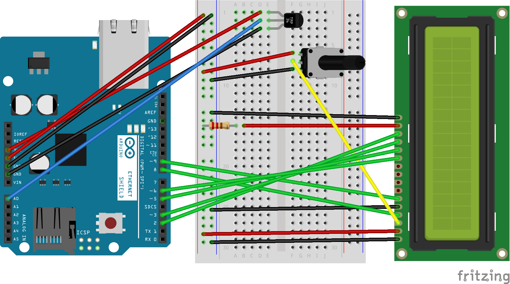
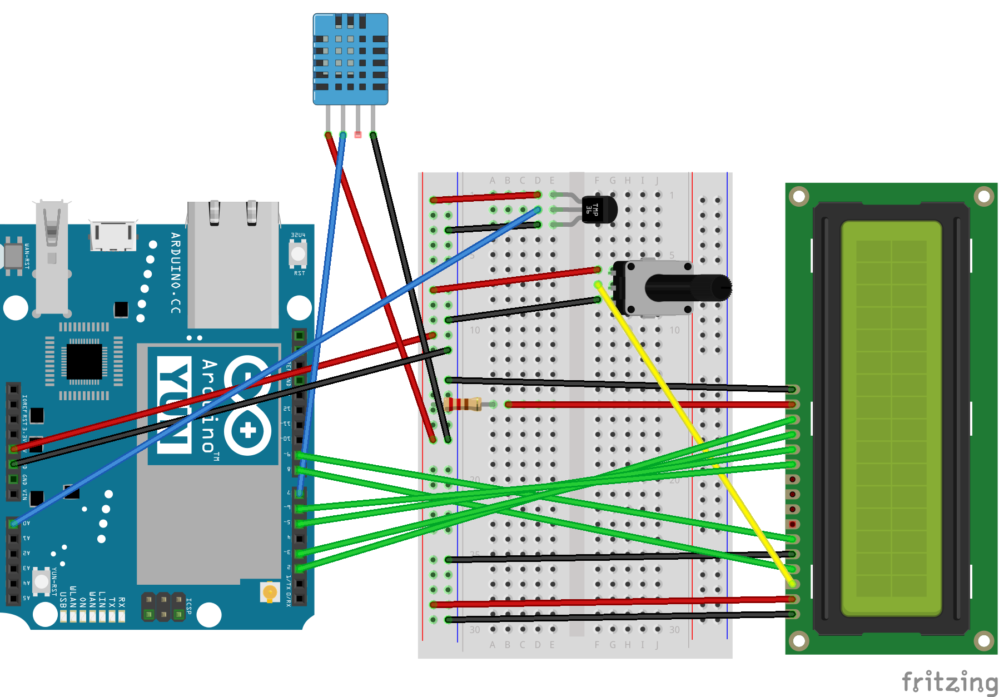

# Arduino Uno + TMP36 + Ethernet + Plotly

Arduino TMP36 sensor temperature logger with Ethernet Shield and Plotly graph.

# Arduino Yún + TMP36 + DHT11 + Parse.com

Arduino temperature and humidity logger using TMP36 and DHT11 sensors; writes data to Parse.com.

